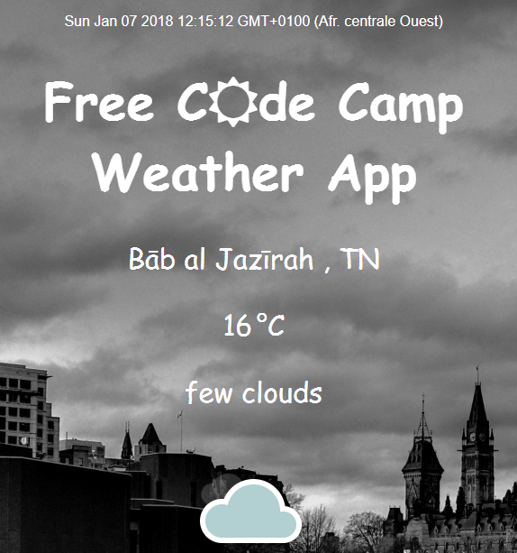

## Have a look at my project ! DEMO

# Local weather application 

this is a web appication where you can get the weather in your actual position  .

# Project brief 
* This is a small web application wich does the following:
- seeing the weather in my current location.
- seeing different icon and background image depending on the weather. 
- toggling between Fahrenheit and Celsius.
- Displaying a loading spinner while the application is loading the weather data.

<p align="center">
  

</p>


### Prerequisites

Things i need to download before starting 

```
font-awsome, jquery 
```

Preparing the project structure 


```
fonts/font-awesome-4.7.0 ; scripts/script.js ; styles/style.css ; index.html
```


## Built With

* Free Code Camp weather API
* [jquery](https://jquery.com/) - The web framework 


## Authors

* **Sarra NAIFAR**


## what i learned

* manipulate DOM with jquery 
* Using weather API : manipulate Json data 
* call Ajax


